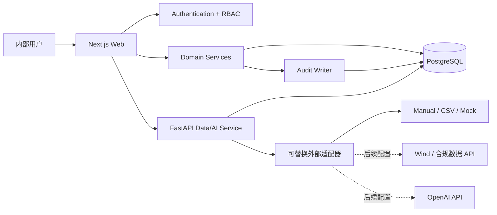

# System Architecture

## 1. 架构决策

首期采用 **模块化单体 + 专用 Python 服务**：

- Web 应用负责 UI、认证、RBAC、业务事务、审计和 PostgreSQL 访问；
- FastAPI 负责后续采集、金融计算、文档处理和 RAG Provider；
- PostgreSQL 是唯一业务事实源；
- 定时任务和异步任务首期保留接口，后续根据部署平台接入队列；
- 不引入服务网格、事件总线或多数据库。



## 2. 模块边界

| 模块 | 责任 | 禁止事项 |
|---|---|---|
| Auth | 登录、会话、密码、账号状态 | 不负责业务角色判断 |
| Authorization | 权限和行级策略 | 不依赖前端传入角色 |
| Facts | 事实状态机、来源、版本 | 不覆盖历史版本 |
| Metrics | 指标定义、值、口径、期间 | 不把数值仅存在富文本 |
| Audit | 追加写日志、差异摘要 | 不允许普通业务写入任意日志 |
| Dashboard | 聚合有行动价值的数据 | 不伪造行情和实时动态 |
| Data adapters | 外部数据标准化 | 业务代码不引用供应商字段 |
| AI gateway | RAG 接口、权限过滤、引用 | 不把 Draft 当正式口径 |

## 3. 认证与授权

### 3.1 认证 Provider 接口

```ts
interface AuthProvider {
  authenticate(email: string, password: string): Promise<AuthIdentity | null>;
  createSession(identity: AuthIdentity): Promise<Session>;
  revokeSession(sessionId: string): Promise<void>;
}
```

首期 `CredentialsAuthProvider` 使用 PostgreSQL 用户和密码哈希。未来 `SupabaseAuthProvider` 可替换认证，但应用内角色、权限、审计和组织成员关系仍保留在业务库中。

### 3.2 服务端授权流程

```text
请求 -> 解析并校验 Session -> 检查用户是否启用
     -> 加载角色权限 -> 检查 resource.action
     -> 应用行级策略 -> 执行业务事务 -> 写审计日志
```

Viewer 查询自动附加：

```sql
status = 'APPROVED'
AND deleted_at IS NULL
AND (effective_date IS NULL OR effective_date <= now())
AND (expiry_date IS NULL OR expiry_date > now())
```

## 4. 数据访问与事务

- Drizzle schema 是运行时代码的模型来源；
- SQL 迁移文件纳入版本控制；
- 业务写入、版本快照和审计日志必须在同一数据库事务中完成；
- 所有核心表使用 UUID、`created_at`、`updated_at` 和 `deleted_at`；
- 金额使用 `numeric`，不使用浮点数；
- 时间统一存 UTC，界面按 Asia/Shanghai 展示；
- JSONB 只用于审计差异、可扩展元数据和计算快照，不替代核心关系字段。

## 5. 建议目录结构

```text
.
├── app/                         # Next.js App Router
│   ├── (auth)/login/
│   ├── (workbench)/
│   │   ├── dashboard/
│   │   ├── facts/
│   │   ├── metrics/
│   │   └── audit/
│   └── api/
├── components/
│   ├── layout/
│   ├── tables/
│   ├── forms/
│   └── states/
├── db/
│   ├── schema.ts
│   ├── client.ts
│   ├── migrations/
│   └── seed.ts
├── lib/
│   ├── auth/
│   ├── authorization/
│   ├── audit/
│   ├── facts/
│   ├── metrics/
│   └── validation/
├── services/
│   └── data-ai-api/             # FastAPI
├── packages/
│   └── contracts/               # JSON/OpenAPI 与共享枚举
├── tests/
│   ├── unit/
│   └── e2e/
├── docker-compose.yml
└── docs（根目录设计文档）
```

当前 Web 保持在仓库根目录，以兼容本地预览和现有站点构建工具；仓库仍是包含 Web、Python 服务和共享契约的单一 Monorepo。

## 6. 外部适配器

### 6.1 行情

```ts
interface MarketDataAdapter {
  id: string;
  capabilities(): AdapterCapability[];
  getSecurities(request: SecurityRequest): Promise<NormalizedSecurity[]>;
  getPrices(request: PriceRequest): Promise<NormalizedPrice[]>;
  getFinancials(request: FinancialRequest): Promise<NormalizedFinancial[]>;
}
```

首期只实现 Mock、CSV/Excel 和 Manual。Wind 适配器只有空契约与配置说明，直到用户提供：

- 已授权的 Wind 产品和接入方式；
- SDK/终端环境和操作系统限制；
- 可用字段、频率、配额和合规要求；
- 是否允许服务端定时调用；
- 凭据托管方式。

### 6.2 AI

```ts
interface KnowledgeAnswerProvider {
  answer(input: AuthorizedQuestionContext): Promise<GroundedAnswer>;
}
```

`AuthorizedQuestionContext` 只包含调用者已获授权的 chunk ID、Approved 事实和指标。Provider 不接收整库访问权。

### 6.3 行业动态来源

首个行业动态数据集来自 Notion `01 Projects → 行业雷达` 的人工触发快照，不把 Notion 当作运行时业务数据库：

1. 将行业分类归一化到 `industries`；
2. 将公司和观察主题归一化到 `companies`，并用 `entity_type` 区分；
3. 将时间线事件、摘要、详情、来源限定和外部链接写入 `intelligence_items`；
4. 使用 `intelligence_item_companies` 保存多对多公司关联；
5. 在同一 seed 事务中写入来源、审核信息和导入审计日志。

Web 查询只读取 PostgreSQL 或明确标注的本地 seed fallback，并在服务端执行组织和角色过滤。当前没有持续同步、抓取或 AI 摘要；未来 RSS/公开 API 接入必须走独立适配器，保留失败路径和采集日志。

## 7. 容器与部署

### 本地

Docker Compose 包含：

- `web`：Next.js；
- `db`：PostgreSQL 16；
- `data-ai-api`：FastAPI；
- 可选 `pgadmin` 不纳入默认启动，避免增加攻击面。

### 生产建议

优先采用单区域私有部署：

- Web 和 FastAPI 使用容器平台；
- 托管 PostgreSQL 启用 PITR、加密、私网和每日备份；
- 对象存储用于后续文件；
- 反向代理或平台层终止 TLS；
- 只允许公司 SSO/VPN/访问策略进入；
- 环境变量进入平台 Secret Manager。

生产平台、域名、SSO 和数据库尚未确定，因此首期不执行真实生产发布，也不创建付费资源。

## 8. 可观测性

- 每个请求生成 `request_id`；
- 结构化日志不记录密码、Session、API Key 和文件正文；
- 登录失败、权限拒绝和敏感写入单独标记；
- 健康检查区分进程存活与数据库就绪；
- 外部采集记录 adapter、开始/结束时间、状态、重试和错误摘要。

## 9. 关键风险

| 风险 | 影响 | 缓解 |
|---|---|---|
| 事实口径不一致 | 资本市场回复错误 | 口径字段、版本、冲突检测、审核 |
| Viewer 越权 | 内部信息泄露 | 服务端权限 + 行级过滤 + 权限测试 |
| AI 检索越权 | 文件与草稿泄露 | 检索前 ACL、检索后过滤、引用审计 |
| 外部数据许可不清 | 合规风险 | 适配器隔离，只接授权来源 |
| Excel 导入污染 | 错误批量数据 | 预校验、Dry Run、错误报告、事务导入 |
| 初期过度工程 | 维护成本高 | 模块化单体，队列和微服务延后 |
