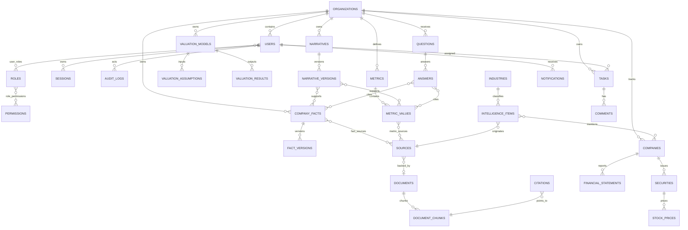

# Data Model

## 1. 建模原则

- 主键使用 UUID；
- 重要业务表包含 `organization_id`；
- 重要业务数据软删除；
- 当前记录与不可变版本表分离；
- 来源、文件和引用是一级实体；
- 多对多关系使用显式关联表；
- 金额和比率使用 `numeric`；
- 审计日志只追加；
- 敏感枚举在数据库和 TypeScript 中保持一致。

## 2. ER 图

## 3. 身份与权限

### organizations

`id`, `name`, `slug`, `created_at`, `updated_at`, `deleted_at`

### users

`id`, `organization_id`, `email`, `display_name`, `password_hash`, `status`, `last_login_at`, `password_changed_at`, `invited_by`, `invited_at`, `created_at`, `updated_at`, `deleted_at`

`email` 在组织内唯一；状态为 `INVITED | ACTIVE | DISABLED`。

### roles / permissions

- `roles`: `id`, `organization_id`, `code`, `name`, `description`, timestamps
- `permissions`: `id`, `code`, `resource`, `action`, `description`
- `user_roles`: `user_id`, `role_id`, `created_at`, `created_by`
- `role_permissions`: `role_id`, `permission_id`, `created_at`

### sessions

`id`, `user_id`, `token_hash`, `expires_at`, `last_seen_at`, `ip_address`, `user_agent`, `revoked_at`, `created_at`

数据库只保存会话 Token 哈希。

### login_logs

`id`, `organization_id`, `user_id?`, `email_attempted`, `result`, `ip_address`, `user_agent`, `reason`, `created_at`

### audit_logs

`id`, `organization_id`, `actor_user_id?`, `action`, `resource_type`, `resource_id?`, `request_id`, `before_json`, `after_json`, `metadata_json`, `ip_address`, `user_agent`, `created_at`

## 4. 公司事实

### company_facts

`id`, `organization_id`, `primary_category`, `secondary_category`, `title`, `content`, `numeric_value`, `unit`, `measurement_basis`, `period_start`, `period_end`, `period_label`, `owner_user_id`, `status`, `reviewer_user_id`, `reviewed_at`, `effective_date`, `expiry_date`, `current_version_no`, `created_by`, `updated_by`, `created_at`, `updated_at`, `deleted_at`

### fact_versions

`id`, `fact_id`, `version_no`, `snapshot_json`, `change_summary`, `status`, `created_by`, `created_at`

唯一约束：`(fact_id, version_no)`。

### fact_sources

`fact_id`, `source_id`, `source_quote`, `is_primary`, `created_at`

批准前，重要分类要求至少一个来源；这一规则由服务层根据分类配置执行。

## 5. 指标

### metrics

`id`, `organization_id`, `code`, `name`, `description`, `default_unit`, `data_type`, `measurement_basis`, `owner_user_id`, timestamps, `deleted_at`

唯一约束：`(organization_id, code)`。

### metric_values

`id`, `metric_id`, `value_type`, `scenario`, `frequency`, `period_start`, `period_end`, `period_label`, `value_numeric`, `unit`, `currency`, `measurement_basis`, `status`, `source_id`, `owner_user_id`, `reviewer_user_id`, `reviewed_at`, `version_no`, `created_by`, `updated_by`, timestamps, `deleted_at`

唯一活动记录约束由服务层维护：同一指标、类型、情景、频率、期间只有一个非删除当前版本。

## 6. 市场与财务

### companies / securities / stock_prices

- `companies`: 名称、简称、国家、行业、关注逻辑、风险、内部结论、负责人
- `securities`: 公司、代码、交易所、币种、证券类型、是否主要证券
- `stock_prices`: 证券、日期、开高低收、复权收盘、成交量、成交额、市值、来源

### financial_statements

`company_id`, `statement_type`, `period_start`, `period_end`, `frequency`, `currency`, `line_items_json`, `source_id`, `status`, timestamps

首期将供应商行项目标准化后保存，并保留原始字段映射。

## 7. 估值

### valuation_models

`id`, `organization_id`, `name`, `model_type`, `scenario`, `status`, `version_no`, `parent_model_id`, `created_by`, `updated_by`, timestamps, `deleted_at`

### valuation_assumptions

`id`, `model_id`, `key`, `label`, `year`, `value_numeric`, `unit`, `is_input`, `formula`, `source_id`, `sort_order`

### valuation_results

`id`, `model_id`, `key`, `label`, `value_numeric`, `unit`, `formula`, `calculation_snapshot_json`, `created_at`

## 8. 情报

### industries

`id`, `name`, `slug`, `parent_id?`, `description`, `notion_page_url`, timestamps

### intelligence_items

`id`, `organization_id`, `industry_id`, `title`, `summary`, `details`, `source_id`, `original_url`, `notion_page_url`, `source_note`, `source_links_json`, `published_at`, `fetched_at`, `event_type`, `importance`, `relationship_to_company`, `potential_impact`, `analyst_comment`, `is_read`, `is_adopted`, `tags`, `status`, `owner_user_id`, `reviewer_user_id`, `reviewed_at`, timestamps, `deleted_at`

`source_links_json` 只保存一条事件可变数量的外部原文引用；行业、来源、负责人、审核人和公司关联仍使用外键。Notion 导入内容保存为 `Approved`，并在来源说明中保留“公司表述”“媒体报道”“传闻/未确认”和“内部分析”等限定，不把推断升级为事实。

### intelligence_item_companies

`intelligence_item_id`, `company_id`, `mention_type`, `confidence`

复合主键为 `(intelligence_item_id, company_id)`。当前 Notion 快照以 `PRIMARY` 或 `MENTIONED` 标识关联类型。

### companies（行业雷达扩展）

在公司基础字段上增加 `entity_type`, `observation_scope`, `notion_page_url`。`entity_type` 允许将 Notion 中非公司的“关键观察”主题与公司实体明确区分。

### ingestion_runs

`id`, `adapter_id`, `started_at`, `finished_at`, `status`, `items_seen`, `items_created`, `items_deduplicated`, `retry_count`, `error_summary`

## 9. 叙事与问答

### narratives / narrative_versions

`narratives` 保存标题、类别、当前版本、保密等级、状态和负责人；`narrative_versions` 保存内容、使用场景、适用对象、修改说明、审核人、生效日期与不可变版本。

关联表：

- `narrative_fact_links`
- `narrative_metric_links`
- `narrative_source_links`

### questions / answers

`questions` 保存提问方、日期、分类、保密等级、负责人和状态；`answers` 保存原始回复、最终回复、回复类型（内部判断/外部口径）、正式使用标记、审核信息和版本。

关联表：

- `answer_fact_links`
- `answer_metric_links`
- `answer_document_links`

## 10. 文件、引用和向量

### sources

`id`, `organization_id`, `source_type`, `title`, `publisher`, `url`, `published_at`, `accessed_at`, `document_id?`, `checksum`, timestamps, `deleted_at`

### documents

`id`, `organization_id`, `title`, `file_name`, `mime_type`, `storage_key`, `size_bytes`, `checksum`, `confidentiality`, `status`, `uploaded_by`, timestamps, `deleted_at`

### document_chunks

`id`, `document_id`, `chunk_index`, `content`, `token_count`, `page_number?`, `embedding vector`, `metadata_json`

向量列在启用 pgvector 后创建；embedding 模型和维度必须写入 metadata，禁止静默更换。

### citations

`id`, `organization_id`, `source_type`, `source_record_id`, `document_chunk_id?`, `quote`, `locator_json`, `created_at`

## 11. 协作

- `tasks`: 标题、类型、状态、优先级、关联资源、负责人、截止时间
- `comments`: 关联资源、正文、作者、编辑和软删除字段
- `notifications`: 接收人、类型、标题、正文、关联资源、已读时间

## 12. 索引

首期必需索引：

- 用户：组织 + email、status；
- 事实：组织 + status + category、更新时间、期间、owner；
- 指标值：metric + scenario + period、status；
- 审计：组织 + created_at、resource_type + resource_id、actor；
- 来源：checksum、URL；
- 文档 chunk：document + chunk_index；
- 软删除高频查询使用部分索引 `WHERE deleted_at IS NULL`。
